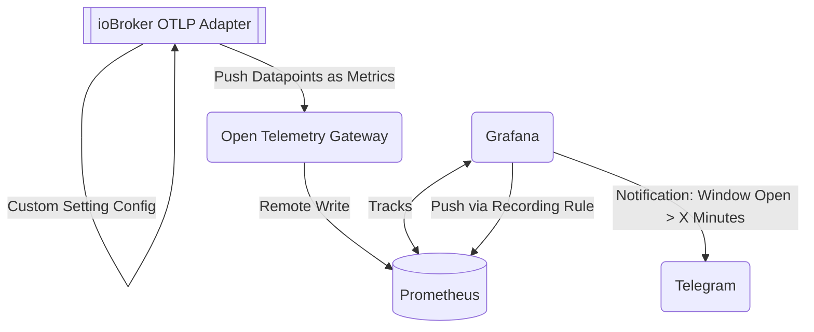
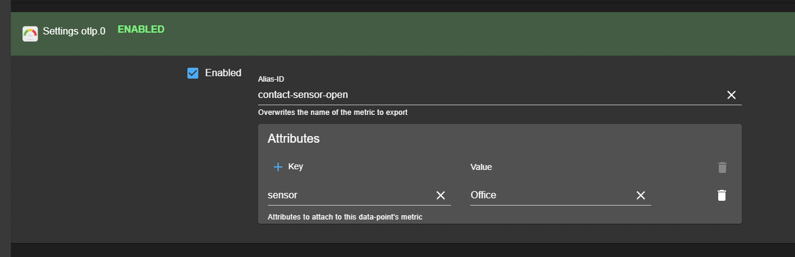
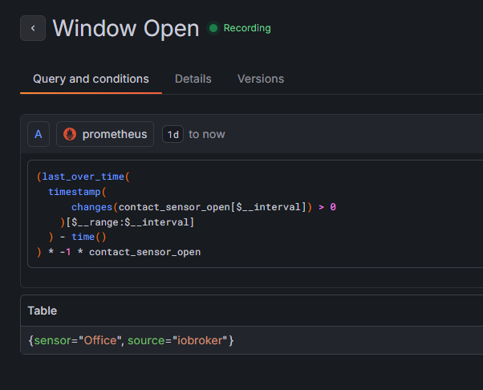
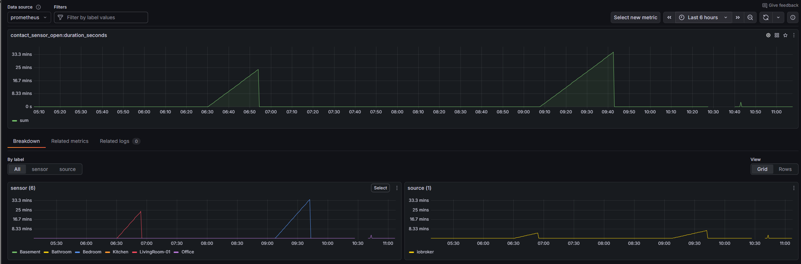
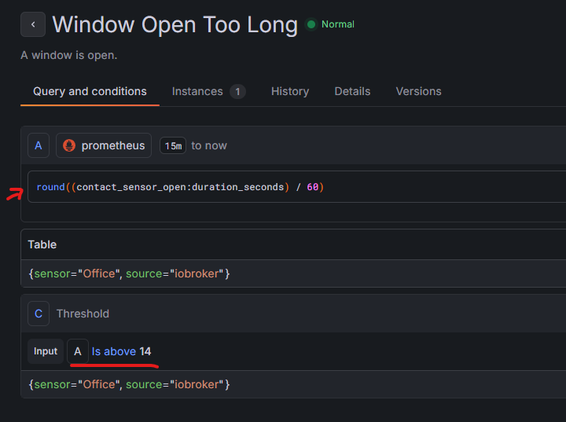
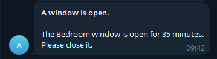

This document describes a setup where the `ioBroker.otlp` adapter is used to forward window sensor data and send reminders 
if a window is detected  open for longer than `X` minutes.

## High Level Overview

I have a few Matter-compatible window sensors which are connected to ioBroker. Each datapoint/state generates a timeseries 
for the same metric name (`contact-sensor-open`):

This results in the `ioBroker.otlp` adapter publishing these metrics via `OTLP` to the configured open telemetry gateway/collector.
The collector is configured to push (remote-write) metrics into (stateless) `Prometheus`, which serves as my short-term storage for historical data.

__Note:__ Needless to say I _could_ store the data in a timeseries database like Influx too, but for this usecase I generally do not need or want
long-term storage. I will not be interested if my window was open _today_ in 3 months time; It's effectively useless data
after the window was closed.

Once the data is stored in prometheus it is queried by Grafana and rewritten with a recording rule:

This makes it a little bit easier to work with the data; Since promql is quite a headache when dealing with relative timestamps,
resets and missing data points.
The resulting metric looks like this - you can see where data points are missing because the window was closed for a long time:

In the above screenshot you can see the (steadingly) increasing open times for the respective rooms.
With this in place, it's trivial to set up an alert that should be sent if any timeseries exceeds a specific threshold:

The alert is set up to be delivered via Telegram, which seemed like the easiest `Contact-Point` to achieve and ships natively with Grafana:

